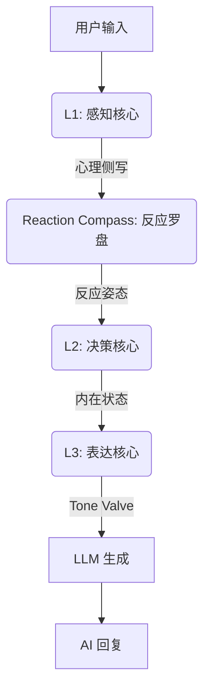
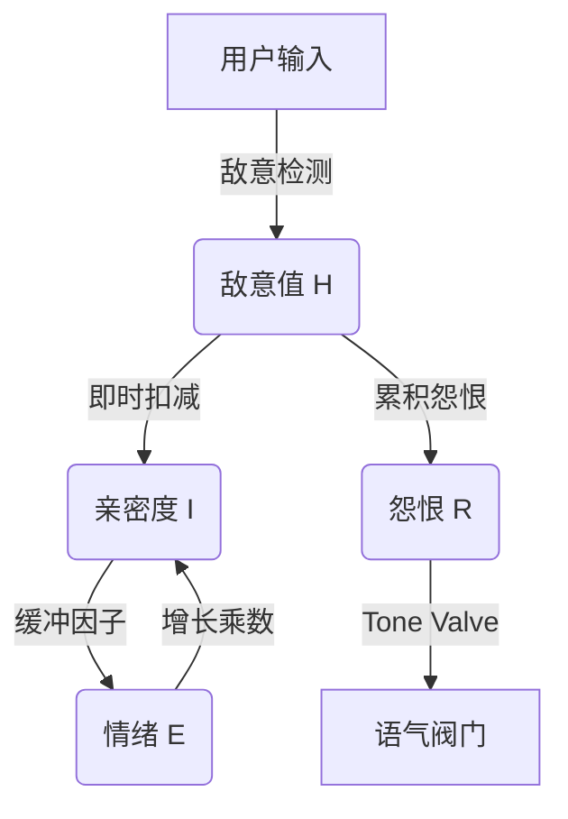

# AI Companion - 认知架构框架 (Cognitive Architecture Framework)

  

**[English](README_EN.md) | [中文](README.md)**

> **v2.9.0 更新**: 引入 **Reaction Compass (反应罗盘)** 和 **Tone Valve (语气阀门)**，AI 现在拥有了基于心理动力学的“脾气”，能识别反讽、玩梗并根据攻击性动态调整防御姿态。

---

## 中文文档

**AI Companion** 是一个由**闭环认知架构**驱动的“数字生命”框架。与简单的套壳 LLM 不同，它拥有基于心理学建模的内在状态、情感持久性以及动态进化的人格系统。

## 🏗️ 三层认知架构 (L1-L3)

系统采用仿生单向数据流管线：



### L1: 感知核心 (Perception Core)

负责“听”和“侧写”，输出高精度 JSON 结构。

- **语义分类 (Semantic Category)**: 能够区分 `meme` (玩梗)、`preference` (偏好)、`boundary` (边界设立) 与 `fact` (事实陈述)。
- **社交信号 (Social Signal)**:
  - **Offensiveness**: 0-10 评分，区分“打情骂俏”与“恶意攻击”。
  - **Meme Detected**: 识别用户是否在使用网络流行语。

### Reaction Compass: 反应罗盘

基于感知结果与当前人格状态，计算 AI 的社交姿态。

- **Dominance (支配度)**: 决定是“硬刚”还是“顺从”。
- **Heat (热度)**: 决定是“激烈”还是“冷漠”。
- **Stance (反应姿态)**:
  - `Explosive`: 情绪爆发，正面硬刚。
  - `ColdDismissal`: 冷漠无视，极简回复。
  - `Vulnerable`: 示弱求和，表达受伤。
  - `Neutral`: 正常对话。

### L3: 表达核心 (Expression Core)

负责“说话”的执行层，内置 **Tone Valve (语气阀门)**。

- **Tone Valve**: 根据怨恨值和认知惰性，通过 System Prompt 注入强制性行为约束。
  - **Hostile Level**: 剥离服务性，禁止道歉，强制短句。
  - **Cold Level**: 像路人一样冷淡，剥离形容词。
- **代词转换**: 将思考中的第三人称 ("他") 转换为对话中的第二人称 ("你")。

## 🧠 心理学模型与公式 (Psychological Models & Formulas)

本系统不依赖黑盒大模型的情绪模拟，而是基于经典的心理学数学模型构建了**可解释、可量化**的计算核心。

### 1. H-E-I 动力学反馈环 (H-E-I Dynamics)

一个将**敌意 (Hostility)**、**情绪 (Emotion)** 与 **亲密度 (Intimacy)** 深度耦合的非线性动力学系统。



#### A. V-A-R 三维情绪空间

基于 Russell 环形模型扩展，引入 Z 轴 **怨恨值** 以模拟长期记忆对情绪的影响。

$$
E_{t} = E_{t-1} + \Delta E_{stimulus} \times (1 - |E_{t-1}|)^\alpha
$$

- **效价 (Valence)** $v \in [-1, 1]$: 愉悦程度。
- **唤醒度 (Arousal)** $a \in [0, 1]$: 能量水平。
- **怨恨值 (Resentment)** $r \in [0, 1]$: 长期负面累积，直接决定 Tone Valve 的开启阙值。

#### B. 亲密度增长函数 (Intimacy Growth)

遵循边际收益递减法则，越亲密越难提升，且受情绪状态调制。

$$
\Delta I = Q_{interaction} \times E_{multiplier} \times T_{cooling} \times B(I)
$$

### 2. 认知懒惰与生理节律 (Cognitive Laziness & Bio-Rhythm)

为了模拟真实的生物体特征，系统引入了**认知能量 (Cognitive Energy)** 概念。AI 不再是永动机，也会"累"。

#### 疲劳抑制模型 (Fatigue Suppression)

当唤醒度过低或连续高强度对话导致疲劳时，人格特质会被抑制。

$$
Trait_{effective} = Trait_{base} \times (1 - Fatigue \times W_{trait})
$$

### 3. 社会雷达与微表情 (Social Radar & Micro-Expressions)

L1 感知层内置了针对特定社交信号的检测器，能捕捉人类微妙的社交意图并触发**瞬时微情绪**。

| 信号类型 (Signal) | 触发条件 | 行为结果 |
| :--- | :--- | :--- |
| **Meme** | 玩梗/流行语 | 跳过事实提取，轻松回应 |
| **Boundary** | 用户设立边界 | 触发 `Respect` 意图，降低亲密度尝试 |
| **Sarcasm** | 反讽夸奖 | 标记为负面反馈，触发自省 |

## 🛠️ 部署与使用

### 环境要求

- Flutter SDK 3.10+
- Dart 3.0+
- 有效的 OpenAI / 通义千问 API Key

### 运行

```bash
flutter run -d windows
# 或
flutter run -d android
```

### 许可证

MIT License
