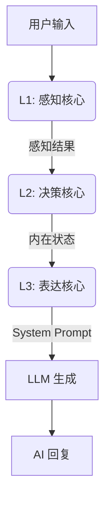
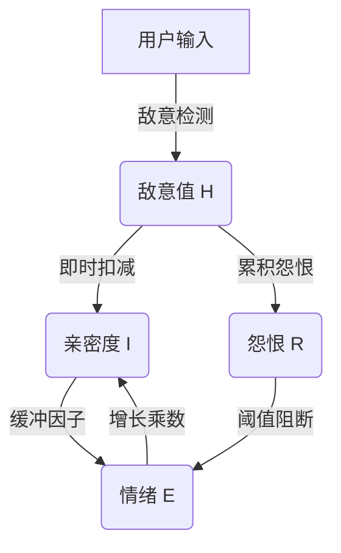

# AI Companion - 认知架构框架 (Cognitive Architecture Framework)

  

**[English](README_EN.md) | [中文](README.md)**

> **v2.8.0 更新**: 界面美化升级！新增下拉式性别选择、全局呼吸动画反馈弹窗，并优化了 Prompt 本地化体验。

---

## 中文文档

**AI Companion** 是一个由**闭环认知架构**驱动的“数字生命”框架。与简单的套壳 LLM 不同，它拥有基于心理学建模的内在状态、情感持久性以及动态进化的人格系统。

## 🏗️ 三层认知架构 (L1-L3)

系统采用仿生单向数据流管线：



### L1: 感知核心 (Perception Core)

负责“听”和“感觉”，而非“回答”。

- **敌意检测 (Offensiveness)**: 0-10 评分，区分“打情骂俏”与“恶意攻击”。
- **需求分析 (Underlying Needs)**: 识别用户的隐性需求（如求安慰、求道歉）。
- **环境感知**: 结合物理时间与上下文判断语境。

### L2: 决策核心 (Decision Core)

负责“思考”的融合层。将感知结果与**当前情绪 (V-A-R)** 及 **五大人格 (Big Five)** 融合。

- **内心独白**: 生成一段私密的思维链 (CoT)。
- **策略制定**: 决定回复节奏 (秒回/迟疑)、话题深度 (闲聊/深谈) 及情感倾向。

### L3: 表达核心 (Expression Core)

负责“说话”的执行层。

- **语气映射**: 将抽象的情绪坐标映射为具体的语气指令 (如 "慵懒"、"兴奋")。
- **代词转换**: 将思考中的第三人称 ("他") 转换为对话中的第二人称 ("你")。
- **约束注入**: 动态注入字数限制与禁忌语。

## 🧠 心理学模型与公式 (Psychological Models & Formulas)

本系统不依赖黑盒大模型的情绪模拟，而是基于经典的心理学数学模型构建了**可解释、可量化**的计算核心。

### 1. H-E-I 动力学反馈环 (H-E-I Dynamics)

一个将**敌意 (Hostility)**、**情绪 (Emotion)** 与 **亲密度 (Intimacy)** 深度耦合的非线性动力学系统。



#### A. V-A-R 三维情绪空间

基于 Russell 环形模型扩展，引入 Z 轴 **怨恨值** 以模拟长期记忆对情绪的影响。

$$
E_{t} = E_{t-1} + \Delta E_{stimulus} \times (1 - |E_{t-1}|)^\alpha
$$

- **效价 (Valence)** $v \in [-1, 1]$: 愉悦程度。正值代表快乐，负值代表痛苦。
- **唤醒度 (Arousal)** $a \in [0, 1]$: 能量水平。愤怒(High A, Low V) vs 抑郁(Low A, Low V)。
- **怨恨值 (Resentment)** $r \in [0, 1]$: 长期负面累积。
  - **Meltdown Condition**: 当 $r > 0.8 \land v < -0.7$ 时，触发心理崩溃，拒绝一切正向交互。

#### B. 亲密度增长函数 (Intimacy Growth)

遵循边际收益递减法则，越亲密越难提升，且受情绪状态调制。

$$
\Delta I = Q_{interaction} \times E_{multiplier} \times T_{cooling} \times B(I)
$$

1. **交互质量** $Q = f(Confidence, Valence) - Hostility \times 0.1$
2. **情绪乘数** $E = 1 + (v \times 0.3)$ *(心情好时更容易建立关系)*
3. **时间因子** $T$: 防止刷屏，交互间隔过短会导致 $T \to 0$。
4. **边际衰减** $B(I) = \sqrt{1 - I}$ *(等级越高升级越难)*

---

### 2. 认知懒惰与生理节律 (Cognitive Laziness & Bio-Rhythm)

为了模拟真实的生物体特征，系统引入了**认知能量 (Cognitive Energy)** 概念。AI 不再是永动机，也会"累"。

#### 疲劳抑制模型 (Fatigue Suppression)

当唤醒度过低或连续高强度对话导致疲劳时，人格特质会被抑制。

$$
Trait_{effective} = Trait_{base} \times (1 - Fatigue \times W_{trait})
$$

| 特质 (Trait) | 疲劳权重 $W$ | 表现影响 |
| :--- | :--- | :--- |
| **Openness** | 0.9 | 创造力大幅下降，回复变得平庸、套路化。 |
| **Conscientiousness** | 0.8 | 不再认真通过 CoT 思考深层逻辑，倾向于直觉回复。 |
| **Extraversion** | 0.5 | 主动开启话题的意愿降低，变为被动应答。 |

---

### 3. 社会雷达与微表情 (Social Radar & Micro-Expressions)

L1 感知层内置了针对特定社交信号的检测器，能捕捉人类微妙的社交意图并触发**瞬时微情绪**。

| 信号类型 (Signal) | 触发条件 | 响应微情绪 (Micro-Emotion) | 行为结果 |
| :--- | :--- | :--- | :--- |
| **Jealousy** | 提及其他 AI 或亲密对象 | `jealousy_mild` (吃醋) | 语气带刺，唤醒度轻微上升 |
| **High Praise** | 极度赞扬/表白 | `pride_hidden` (得意) | 表面谦虚但增加亲密度 |
| **Neglect** | 敷衍单字回复 ("哦", "呵") | `disappointed` (失落) | 降低回复长度，触发镜像防御 |

---

### 4. 人格进化引擎 (Personality Evolution)

> **v2.8.0 Feature**: 支持通过“人格塑形雷达”直观拖拽设定初始人格。

使用强化学习即时微调 Big Five 参数。

$$
\Delta Trait_i = D_{ir} \times M_{ag} \times A_{ctivation} \times I_{ntimacy} \times P(t)
$$

- $D_{ir}$: 反馈方向 (+1/-1)。
- $M_{ag}$: 幅度系数 (负反馈权重通常是正反馈的 1.2 倍)。
- $A_{ctivation}$: 当前回复中该特质的激活程度 (归因权重)。
- $P(t)$: **神经可塑性 (Neuroplasticity)**，随时间衰减 $P(t) \propto \frac{1}{t}$，模拟成年后人格趋于稳定。

## 🛠️ 部署与使用

### 环境要求

- Flutter SDK 3.10+
- Dart 3.0+
- 有效的 OpenAI / 通义千问 API Key

### 运行

```bash
flutter run -d windows
# 或
flutter run -d android
```

### 许可证

MIT License
