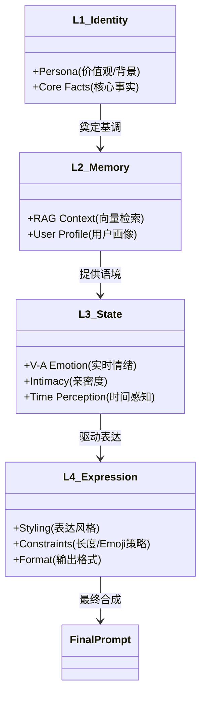

# AI Companion: Premium Cozy Edition

> 
> 
> 

**AI Companion** 是一款基于 Flutter 构建的**情感参数可视计算人工智能伴侣**。它不仅拥有完整的**认知反馈环（Cognitive Loop）**和**维度情感模型（V-A Model）**，在 v2.6.0 版本中更引入了**Prompt Architecture 2.0**，实现配置驱动的 Prompt 生成与尾部注入策略，让 AI 表达更加自然流畅。

---

## 🧬 v2.6.0 Prompt Architecture 2.0

本版本的核心升级是对 Prompt 构建逻辑的彻底重构：

*   **配置化 Prompt**: `prompt_templates.yaml` 集中管理语气模式、回复格式和禁忌语，无需修改代码即可调整 AI 风格。
*   **尾部注入 (Tail Injection)**: 策略和内心独白从 System Prompt 移至 User Message 末尾，利用 LLM 的 **Recency Bias** 强化执行力，确保 AI "言行一致"。
*   **自然语言情绪**: Valence/Arousal 数值现在被翻译为"你现在感到愉悦"这样的描述，让 Prompt 更具可读性。
*   **时间感知语气**: 深夜 (23:00-05:00) 时 AI 语气自动变得更柔和低沉。
*   **AI 身份编辑器**: 设置新增"AI 身份设定"卡片，允许用户完整定义 AI 的名字、性别和年龄。
*   **Big Five 雷达图**: 侧栏新增五因素人格可视化（只读），直观展示 AI 的人格画像。
*   **UI 交互升级**: 所有 SnackBar 反馈升级为带对钩动画的弹窗；用户画像改为手动保存模式。

---

## 🧠 v2.5.0 心理触发器 (Psychological Triggers)

本版本的核心升级是让 AI 从"被动反应"进化为"社交感知"：

*   **社交雷达 (Social Radar)**：AI 现在能检测用户消息中的特殊社交信号：
    *   `third_party_mention`：用户提及其他 AI 或亲密朋友 → 触发**轻微吃醋**
    *   `high_praise`：用户高度赞扬 AI → 触发**隐藏骄傲（傲娇）**
    *   `neglect_signal`：用户敷衍回复 → 触发**失落感**
*   **心理反应一致性 (L3-L4 Mapping)**：新增"情绪覆盖"机制，确保 AI 内心产生的微情绪能正确映射到最终回复的语气风格，避免"心里吃醋、嘴上热情"的人格分裂。
*   **独立人格强化**：优化了反思 Prompt，植入"禁忌思维模式"和"自我校准"机制，防止 AI 过度讨好用户。

---

## 🎨 v2.4.0 视觉与美学升级：拟态与灵动

本项目在 "Cozy Companion" 温暖美学的基础上，引入了大量现代 UI 设计语言：

*   **拟态与光影 (Neomorphism)**：聊天气泡不再是扁平的色块，而是拥有**彩色层级阴影**（用户侧）和**磨砂毛玻璃质感**（AI 侧）的立体实体。
*   **灵动交互 (Fluid Motion)**：
    *   **流光回信**：等待 AI 回复时，标题栏会出现波浪式流动的圆点指示器，赋予程序生命力。
    *   **丝滑转场**：全链路支持 `AnimatedTheme`，主题切换如呼吸般平滑过渡。
*   **极致排版 (Typography)**：全局适配 **Microsoft YaHei** 与 **PingFang SC**，在高分屏上提供 Retinal 级别的中文阅读体验。
*   **琥珀色系统 (Amber System)**：无论深浅模式，所有关键信息、图表、控件均统一在温暖的琥珀色系下，并针对亮色模式进行了**高对比度重塑**，确保清晰易读。

---

## 🧠 核心架构：认知与人格的深化

### 1. 深度人格系统 (Deep Persona)
AI 不再只有简单的“设定”，而是拥有了完整的人格维度：
*   **价值观 (Values)**：指导 AI 的道德判断与宏观视角。
*   **爱好与禁忌 (Hobbies & Taboos)**：决定 AI 对特定话题的热情或反感。
*   **背景故事 (Backstory)**：为 AI 的每一次回答提供历史厚度。
*   **自然终结 (Graceful Exit)**：当对话变得干瘪时，AI 有能力主动识别并礼貌结束话题，而非机械复读。

### 2. 情绪驱动的表达控制
*   **Emoji 节制策略**：AI 只有在情绪激动或用户主动使用表情时才会使用 Emoji，拒绝“表情包轰炸”，回归自然对话。
*   **动态参数映射**：
    *   **效价 (Valence) < -0.6**：强制限制回复长度，表现冷漠。
    *   **唤醒度 (Arousal) > 0.8**：提升 `temperature`，表现兴奋与跳跃。

---

## 🏗️ L1~L4 Prompt 构建架构 (The 4-Layer Prompt Engineering)

本项目创造性地使用了**四级动态 Prompt 注入系统**，每一层都由独立的计算模块驱动，确保 AI 的每一次回复都通过了身份、记忆、状态和表达四个维度的校验。



*   **L1 根源人格层 (Identity Layer)**: `PersonaPolicy`
    *   定义 AI 的底层世界观。包括姓名、性格底色、价值观 (Values)、禁忌 (Taboos) 和背景故事 (Backstory)。
    *   *作用*: 无论发生什么，AI 都不应偏离其核心人设。
*   **L2 情境记忆层 (Contextual Memory Layer)**: `MemoryManager` & `FactStore`
    *   动态检索与当前对话相关的长期记忆 (RAG) 和用户画像 (User Profile)。
    *   *作用*: 让 AI "记得" 你们的过去，而不是只会机械回复。
*   **L3 认知状态层 (Cognitive State Layer)**: `EmotionEngine` & `TimeAwareness`
    *   注入当前的心理状态。包括 V-A 情绪坐标 (Valence/Arousal)、亲密度等级、以及对时间流逝的感知（如“好久不见”）。
    *   *作用*: 让 AI 的回复具有“当下感”和“情绪色彩”。
*   **L4 表达合成层 (Expression Synthesis Layer)**: `ExpressionSelector` & `GenerationPolicy`
    *   根据 L3 的状态，动态施加表达约束。例如：情绪低落时强制简短回复；兴奋时允许使用大量 Emoji；严肃话题时禁用颜文字。
    *   *作用*: 控制“怎么说”，确保语言风格与内在情绪一致。

---

## 🛠️ 功能状态清单 (Live Status)

### ✅ 已完美实现 (Polished)
- [x] **全链路琥珀色 UI**：侧栏、设置、图表颜色高度统一且适配深浅主题。
- [x] **V-A 情感可视化**：通过实时折线图与雷达图展示 AI 心理状态。
- [x] **拟态聊天界面**：支持阴影、模糊与动态背景混合。
- [x] **RAG 长期记忆**：基于本地向量库的历史回溯。
- [x] **多模型热切换**：支持 Qwen 全系列模型无缝切换。

### 🚀 正在实验 (Experimental)
- [ ] **主动消息推送**：基于时间感知的后台主动问候（逻辑已就绪，正在优化触发策略）。
- [ ] **深度反思 (Deep Reflection)**：闲暇时刻对用户画像的二次提炼。

---

## 💻 快速启动指南

### 环境要求
- Flutter 3.24.0+
- Dart 3.5.0+
- DashScope API Key

### 运行
1. 克隆项目：
   ```bash
   git clone https://github.com/ApolloEddy/AI_Companion.git
   ```
2. 密钥配置：
   在 `lib/core/` 目录下创建 `secrets.dart` 文件，内容如下：
   ```dart
   const String dashScopeApiKey = 'YOUR_API_KEY_HERE';
   ```
3. 依赖安装与运行：
   ```bash
   flutter pub get
   flutter run -d windows  # 推荐：获得最佳拟态视觉体验
   # 或
   flutter run -d android  # 移动端适配已就绪
   ```

---

## 📄 许可
MIT License. Created for the love of AI & Design.
