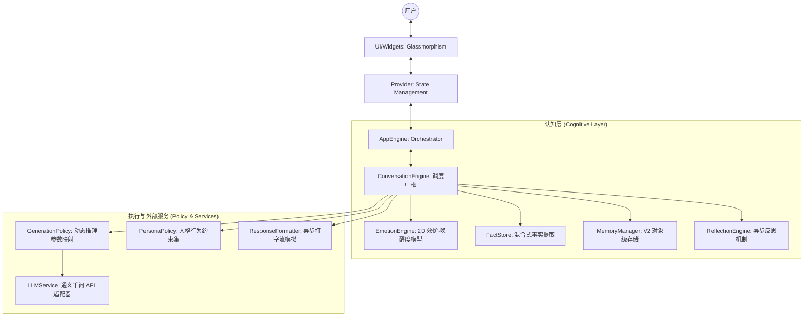
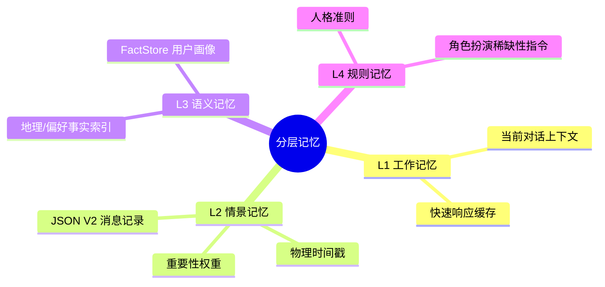

# AI Companion: 基于策略驱动架构的认知型虚拟伙伴

AI Companion 是一个采用 **策略驱动（Policy-Driven）** 与 **认知引擎（Cognitive Engine）** 架构构建的 Flutter 应用程序。不同于传统的指令式 ChatBot，本项目旨在实现一个具有动态情绪演变、分层记忆检索及透明化逻辑处理的深度虚拟伙伴系统。

---

## 1. 框架实现原理 (Architectural Principles)

核心设计哲学：**AI 的行为应由其内部认知状态（情绪、关系、时间感）动态驱动，而非单一的 Prompt 硬编码。**

### 1.1 系统架构概览 (System Layout)

项目采用三层解耦架构：**适配层 (UI/Provider)** -> **认知引擎层 (Cognitive Engine)** -> **策略执行层 (Execution Policy)**。

### 1.2 分层记忆模型 (Layered Memory Hierarchy)

系统通过 `MemoryManager` 维护一个多粒度的记忆存储体系，通过 `WeightedScore` 算法实现拟人化的检索与遗忘。

- **L2 情景记忆检索算法**：`Score = (Keyword * 0.6) + (Recency * 0.2) + (Importance * 0.2)`。根据 `memoryDecayDays` 参数实现自然的遗忘曲线。

### 1.3 2D 情绪坐标系 (Valence-Arousal Model)

AI 内部维护一个连续的情绪向量：
- **Valence (效价)**：[-1.0, 1.0]，代表从极度悲伤到极度快乐。
- **Arousal (唤起度)**：[0.0, 1.0]，代表从平静淡漠到极度兴奋。

该向量实时驱动 `AmbientBackground` 的着色器计算，并直接映射至 `GenerationPolicy` 中的 `temperature` 与 `top_p` 参数。

---

## 2. 功能实现状态 (Feature Status Matrix)

本节严格区分已上线功能与目前代码库中存在的逻辑问题/占位符。

### 2.1 核心实现 (Implemented & Verified)
- **Neural HUD 侧边栏**：实时渲染情绪波形、关系进度条，支持 Formal/Humor 滑块调节。
- **混合事实提取 (Hybrid FactStore)**：正则触发(Regex Gate)结合 LLM 语义分析，精准捕捉用户所在地与习性。
- **Token/Prompt 透明化**：长按消息气泡可查看该次生成的完整 System Prompt 与 阶梯式 Token 消耗。
- **数据迁移系统**：支持旧版 `List<String>` 记忆自动升级至 V2 对象格式，补全元数据。
- **Ethereal Flow UI**：全局玻璃拟态组件、基于情绪向量的实时流体背景。

### 2.2 逻辑限制与已知问题 (Limitations & Known Stubs)
- **非实时流式输出 (Pseudo-Streaming)**：虽然 `LLMService` 提供了 Stream 接口，但目前仍为 **Blocking Mode** 调用。API 完全返回后才由 `ResponseFormatter` 模拟打字间隔。
- **非系统级主动消息**：受限于移动端后台保活机制，目前的“主动关怀”属于 **Virtual Drift** 方案。仅在应用冷启动/唤醒时计算上次离线至今的时间差并触发相应问候。
- **异步反思瓶颈**：目前的 `ReflectionEngine` 仅能定期提取短句记忆，尚未实现对用户长期性格画像（Personality Profile）的自动化演进修改。

---

## 3. 开发与运行指南

### 3.1 环境要求
- Flutter SDK版本 >= 3.0
- Dart SDK版本 >= 3.0

### 3.2 API 密钥配置
在应用初始化前，需在 `AppConfig` 或通过 UI 设置界面填入 DashScope API Key。

### 3.3 目录结构
- `/lib/core/engine/`：包含认知引擎核心源码。
- `/lib/core/policy/`：外部注入的行为准则配置。
- `/lib/ui/widgets/`：高性能 UI 组件（采用 Glassmorphism 设计规范）。

---

## 4. License
MIT License
