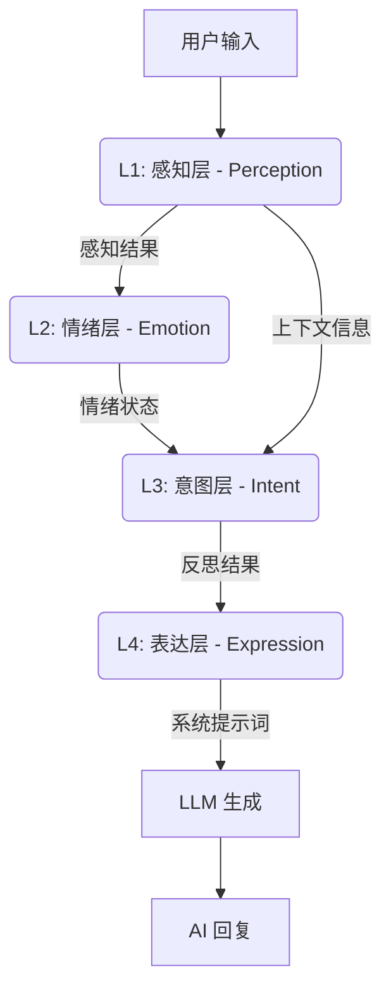

# AI Companion: 基于心理学建模的认知智能架构框架

  

**AI Companion** 不仅仅是一个聊天机器人；它是一个由**闭环认知架构**驱动的“数字生命”。与仅依赖提示词工程（Prompt Engineering）的传统 LLM 封装应用不同，本项目实现了一套源自人类心理学建模的连续状态机，使其区别于标准 AI 的无状态（Stateless）请求-响应循环。

## 🧠 核心理念

系统的构建基于一个前提：**智能需要内在状态（Internal State）**。

- **情感持久性**：情绪会随时间持续并自然衰减，即使在用户离开时亦然。
- **社交边界感**：通过“敌意检测”与“心理创伤”机制，AI 具备了自尊心，能够拒绝侮辱性交互。
- **动态人格控制**：人格并非静态的文本描述，而是通过“五大人格（Big Five）”参数化的向量，实时调节感知与表达。

---

## 🏗️ 四层认知架构 (4-Layer Cognitive Architecture)

系统采用受生物认知过程启发的单向数据流管线。



### L1: 社交感知 (感知分析层)

负责“理解”而非“回复”。分析用户消息中的：

- **攻击性 (Offensiveness, 0-10)**：检测敌意、调侃或辱骂。
- **底层需求 (Underlying Needs)**：识别含蓄的需求，如 `寻求安慰`、`道歉` 或 `夸奖`。
- **置信度 (Confidence)**：评估对当前语境理解的准确度。

### L2: 情感计算 (内在状态层)

“数字灵魂”的核心引擎。根据感知结果更新内在状态：

- **效价 (Valence, V)**：正负情绪映射（如：快乐 vs 难过）。
- **唤醒度 (Arousal, A)**：能量/警觉水平（如：兴奋 vs 疲惫）。
- **怨恨值 (Resentment, R)**：长期积累的负面情感。

### L3: 意图决策 (认知反思层)

在开口前的“内心审问”。通过第三人称思维决定**要做什么**：

- **内心独白**：生成一段私密的思考流。
- **节奏协议 (Pacing)**：决定是 `单次回复`、`爆发模式` 还是 `迟疑回应`。
- **深度过滤**：决定是进入深层共情（情感类）还是保持浅层应对（事实/琐事类）。

### L4: 表达合成 (语言生成层)

“语言中枢”。将抽象的 L3 意图转化为 LLM 能够理解的自然语言系统提示词（System Prompt）：

- **语气调节**：将 (V, A) 状态映射为特定的语言风格（例如：低效价 + 高唤醒 = “冷淡/疏离”）。
- **人格注入**：注入 `{personaGender}` 等身份锚点。
- **约束应用**：实施字数限制、格式规范及避词检查。

---

## 📐 心理学建模与算法公式

### 1. H-E-I 反馈环路

系统将**敌意 (Hostility)**、**情绪 (Emotion)** 与 **亲密度 (Intimacy)** 耦合进一个统一的动态模型中。

#### 情绪动力学 (V-A-R 模型)

在 Russell 的情感环形模型基础上，我们增加了 Z 轴：**怨恨值 (Resentment)**。
为了模拟“情绪惯性”，更新函数采用了非线性设计：

```math
E_{t} = E_{t-1} + \Delta E_{stimulus} \times (1 - |E_{t-1}|)^\alpha
```

*当情绪接近极端值（-1.0 或 1.0）时，进一步改变的阻力会变大（软边界效应）。*

#### 亲密度增长函数

亲密度并非简单的计数器，它遵循**对数增长曲线**，并受到负反馈系数的影响：

```math
\Delta I = Q \times E_{multi} \times T_{cool} \times B(I)
```

其中：

- **Q (质量因子)**：$f(\text{置信度}, \text{效价}) - (\text{攻击性} \times 0.1)$
- **E (情绪加成)**：$1 + (Valence \times 0.3)$ —— *开心的 AI 建立关系更快。*
- **T (时间因子)**：惩罚“轰炸式”交互，奖励有节奏的互动。
- **B (边际衰减函数)**：$(1 - I)^{0.5}$ —— *亲密度越高，提升越难（边际收益递减）。*

### 2. 人格向量 (Big Five Model)

AI 的个性由 OCEAN 模型定义，直接影响 LLM 的概率分布分布偏移：

| 特质 (Trait) | 对系统的影响 |
|-------|------------------|
| **开放性 (Openness)** | 调节 `topic_depth` 的选择概率（抽象深度 vs 事实表面）。 |
| **尽责性 (Conscientiousness)** | 影响 `formality` (严谨度) 以及对比格式规范的遵守程度。 |
| **外向性 (Extraversion)** | 与 `temperature` 参数及 `burst` (爆发) 节奏的触发概率正相关。 |
| **宜人性 (Agreeableness)** | 与针对敌意检测的灵敏度阈值负相关（高宜人性更包容）。 |
| **神经质 (Neuroticism)** | 负面事件触发时 `arousal` (唤醒度) 飙升幅度的乘数。 |

---

## 🛠️ 安装与使用

### 环境要求

- Flutter SDK 3.10+
- Dart 3.0+
- 有效的 OpenAI/DashScope (通义千问) API Key

### 快速开始

1. 克隆仓库：

   ```bash
   git clone https://github.com/ApolloEddy/AI_Companion.git
   ```

2. 安装依赖：

   ```bash
   flutter pub get
   ```

3. 在 Windows/Android 运行：

   ```bash
   flutter run -d windows
   # 或
   flutter run -d android
   ```

### 配置建议

- **模型选择**：建议在设置中选择 `qwen-max` 或 `qwen-plus` 以获得最佳的认知反思能力。
- **人格编辑**：使用内置的编辑器自定义名字、性别、物种以及背景故事。

---

## 📄 开源协议

MIT License. 由 [ApolloEddy] 开发。
