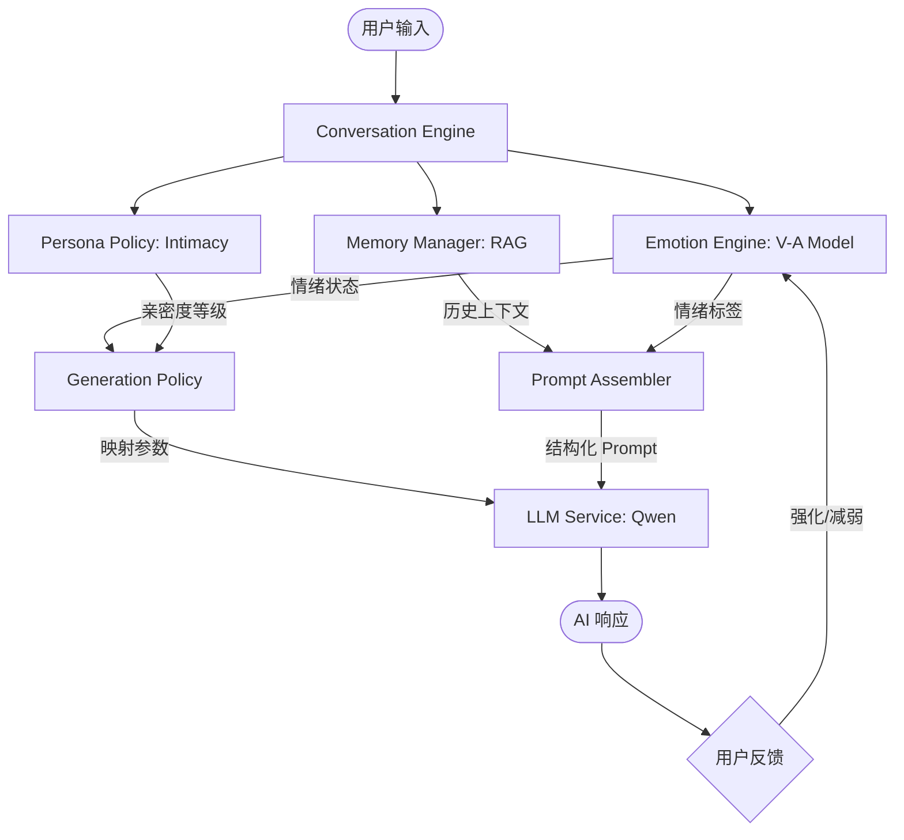

# AI Companion: Research-Grade Ethereal OS

> 
> 
> 

**AI Companion** 是一款基于 Flutter 构建的情感参数可视计算人工智能伴侣。与普通的聊天机器人不同，它拥有完整的**认知反馈环（Cognitive Loop）**、**维度情感模型（V-A Model）**以及**动态生成策略（Generation Policy）**，旨在将 LLM 从单纯的生产力工具转变为具备生命感和个性厚度的数字伴侣。

---

## 🌌 核心哲学：视觉与灵魂的共鸣

本项目在设计上追求 **"Ethereal HUD" (飘渺平显)** 风格，专为深色模式优化。

*   **光效美学**：使用 HSL 空间计算，将 AI 的**亲密度（Intimacy）**设定为背景基调，将**实时情绪（Emotion）**设定为动态扰动，实现视觉层面的“察言观色”。
*   **交互深度**：每一条消息的生成参数（Temperature, Max Tokens）都由 AI 的当前的心理状态动态驱动，而非硬编码。

---

## 🧠 理论架构与机制分析

### 1. 认知调度环 (Cognitive Engine)
系统采用分层架构，彻底分离业务逻辑、情感计算与生成执行。

### 2. 参数映射机制 (The Mapping Logic)
项目实现了一套严谨的**生成动力学**映射，AI 的回复风格受物理参数限制：

| 心理维度 | 状态区间 | LLM 参数调整 (Mapping) | 表现后果 |
| :--- | :--- | :--- | :--- |
| **效价 (Valence)** | 极端负面 (< -0.6) | `max_tokens` 强制限制为 20 | AI 表现为冷漠、愤怒，拒绝长篇大论 |
| **唤醒度 (Arousal)** | 极高活力 (> 0.8) | `temperature` 提升至 1.1 | AI 表现为兴奋或语无伦次，语言多样性激增 |
| **亲密度 (Intimacy)** | 萌芽状态 (< 0.2) | 关键词提示词增强 | 保持礼貌距离感，使用敬语 |
| **亲密度 (Intimacy)** | 深厚羁绊 (> 0.7) | 开锁更多历史 Context | 记忆深度增加，表现为“默契” |

### 3. 时间感知与熵增 (Temporal Entropy)
AI 拥有独立的时间线。`ConversationEngine` 通过心跳定时器（Heartbeat Timer）计算情绪衰减。
- **熵增现象**：随着时间推移，强烈的愤怒或喜悦会向中性基位回归。
- **久别感知**：若用户长时间未上线，AI 会根据 `LastSeenTime` 生成带有“怀念”或“生疏感”的主动问候。

---

## 🛠️ 功能实现清单 (Real-world Status)

### ✅ 已深度实现 (Implemented)
- [x] **V-A 维度情感引擎**：实时计算 Valence（效价）与 Arousal（唤醒度）。
- [x] **RAG 长期记忆**：基于本地向量和关键词的历史信息检索。
- [x] **用户画像锚点**：自动提取用户姓名、职业、性别并持久化，构建身份认知。
- [x] **UI 自适应框架**：`UIAdapter` 自动转换各端（Windows/Android）的阅读体验。
- [x] **多模型对齐**：完整接入 Qwen 系列（Max, Plus, Flash, Turbo）官方 API 规范。
- [x] **物理参数约束**：情感状态强制干预 LLM 生成长度与随机性。

### 🌓 部分完成 / 实验中 (Partial)
- [ ] **异步反思机制 (Reflection)**：AI 在闲暇时对历史对话进行深层次总结（逻辑已预留）。
- [ ] **主动消息策略**：目前实现了启动时的自适应问候，实时后台推送待完善。

### ❌ 暂未实现 (Planned/Not Implemented)
- [ ] **实时语音交互**：尚未集成低延迟双工语音系统。
- [ ] **多模态视觉感知**：不支持直接分析用户上传的照片。

---

## 🚀 开发者指南

### 环境依赖
- Flutter 3.24.0+
- Dart 3.5.0+
- DashScope (阿里云灵积) API Key

### 快速启动
1. 克隆仓库。
2. 在 `lib/core/` 下创建 `secrets.dart` 并配置 `dashScopeApiKey`。
3. 运行 `flutter pub get`。
4. 运行 `flutter run -d windows` (推荐) 或 `android`。

---

## 📄 许可说明
本项目遵循 **MIT 开源协议**。欢迎在学术研究或情感计算探索中使用，请注明出处。
