# AI Companion - 认知架构框架 (Cognitive Architecture Framework)

  

**[English](README_EN.md) | [中文](README.md)**

> **v2.8.0 更新**: 界面美化升级！新增下拉式性别选择、全局呼吸动画反馈弹窗，并优化了 Prompt 本地化体验。

---

## 中文文档

**AI Companion** 是一个由**闭环认知架构**驱动的“数字生命”框架。与简单的套壳 LLM 不同，它拥有基于心理学建模的内在状态、情感持久性以及动态进化的人格系统。

## 🏗️ 三层认知架构 (L1-L3)

系统采用仿生单向数据流管线：

```mermaid
graph TD
    UserInput[用户输入] --> L1(L1: 感知核心)
    L1 -->|感知结果| L2(L2: 决策核心)
    L2 -->|内在状态| L3(L3: 表达核心)
    L3 -->|System Prompt| LLM[LLM 生成]
    LLM --> Output[AI 回复]
```



### L1: 感知核心 (Perception Core)

负责“听”和“感觉”，而非“回答”。

- **敌意检测 (Offensiveness)**: 0-10 评分，区分“打情骂俏”与“恶意攻击”。
- **需求分析 (Underlying Needs)**: 识别用户的隐性需求（如求安慰、求道歉）。
- **环境感知**: 结合物理时间与上下文判断语境。

### L2: 决策核心 (Decision Core)

负责“思考”的融合层。将感知结果与**当前情绪 (V-A-R)** 及 **五大人格 (Big Five)** 融合。

- **内心独白**: 生成一段私密的思维链 (CoT)。
- **策略制定**: 决定回复节奏 (秒回/迟疑)、话题深度 (闲聊/深谈) 及情感倾向。

### L3: 表达核心 (Expression Core)

负责“说话”的执行层。

- **语气映射**: 将抽象的情绪坐标映射为具体的语气指令 (如 "慵懒"、"兴奋")。
- **代词转换**: 将思考中的第三人称 ("他") 转换为对话中的第二人称 ("你")。
- **约束注入**: 动态注入字数限制与禁忌语。

## 🧠 心理学模型与公式

### 1. H-E-I 动力学反馈环

将**敌意 (Hostility)**、**情绪 (Emotion)** 与 **亲密度 (Intimacy)** 耦合的统一模型。

#### V-A-R 情绪模型

基于 Russell 环形模型，增加了 Z 轴 **怨恨值 (Resentment)**。

```math
E_{t} = E_{t-1} + \Delta E_{stimulus} \times (1 - |E_{t-1}|)^\alpha
```

- **效价 (Valence)**: 愉悦程度 (-1 ~ 1)。
- **唤醒度 (Arousal)**: 能量水平 (0 ~ 1)。即便是愤怒也是高唤醒。
- **怨恨值 (Resentment)**: 长期累积的负面状态。*怨恨值 > 0.8 会触发心理创伤模式 (Trauma Mode)*。

#### 亲密度增长函数

遵循边际收益递减的对数曲线：

```math
\Delta I = Q \times E \times T \times B(I)
```

- **Q (质量)**: 交互质量评分，受敌意值负修正。
- **E (情绪加成)**: $1 + (Valence \times 0.3)$ *(开心的 AI 建立关系更快)*。
- **T (时间因子)**: 冷却系数，防止刷分。
- **B (边际衰减)**: $(1 - I)^{0.5}$ *(亲密度越高越难提升)*。

### 2. 人格引擎 (Big Five)

> **v2.8.0 Feature**: 支持通过“人格塑形雷达”直观拖拽设定初始人格，并实时监测人格漂移。

基于 OCEAN 模型，通过用户反馈进行微调演化。

基于 OCEAN 模型，通过用户反馈进行微调演化。

```math
\Delta Trait_i = D \times M \times A_i \times I \times P(t)
```

- **开放性 (Openness)**: 决定对话的抽象程度。
- **尽责性 (Conscientiousness)**: 影响对指令的服从度。
- **外向性 (Extraversion)**: 决定主动开启话题的频率。
- **宜人性 (Agreeableness)**: 决定对冒犯行为的容忍阈值。
- **神经质 (Neuroticism)**: 决定情绪波动的幅度。

## 🛠️ 部署与使用

### 环境要求

- Flutter SDK 3.10+
- Dart 3.0+
- 有效的 OpenAI / 通义千问 API Key

### 运行

```bash
flutter run -d windows
# 或
flutter run -d android
```

### 许可证

MIT License
