# AI Companion - 认知架构驱动的数字生命框架

   

**[English](README_EN.md) | 中文**

> **v3.0.0**: L3 表达层纯执行层重构 —— AI 不再"自作主张"，彻底实现了架构分层的权责分明。

---

## 📖 项目简介

**AI Companion** 不是一个简单的 LLM 聊天界面，而是一个由**闭环认知架构**驱动的"数字生命"框架。

与传统"套壳"应用不同，AI Companion 拥有：

- **持久化的内在状态**：情绪不会因对话结束而消失
- **心理学建模的情感系统**：基于 Russell 环形模型的 V-A-R 三维空间
- **动态进化的人格**：Big Five 人格特质随交互反馈缓慢调整
- **可量化的社交关系**：亲密度遵循边际收益递减的数学模型
- **生物节律模拟**：AI 也会"累"，深夜响应会变得懒散

---

## ✨ 软件特色

### 🧠 三层认知架构 (L1-L3)

系统采用仿生单向数据流管线，严格分离感知、决策与执行：

```mermaid
graph LR
    Input[用户输入] --> L1(L1 感知核心<br/>Perception)
    L1 --> Compass(反应罗盘<br/>Reaction Compass)
    Compass --> L2(L2 决策核心<br/>Decision)
    L2 --> L3(L3 表达执行器<br/>Expression)
    L3 --> Valve(语气阀门<br/>Tone Valve)
    Valve --> LLM[LLM 生成]
    LLM --> Output[AI 回复]
```



### 💔 真实的情感反馈

AI 会因攻击性言论产生**怨恨**，累积到阈值后触发**心理创伤模式**，进入冷淡防御状态。必须通过时间或真诚道歉才能恢复。

### 🎭 四种社交姿态

基于 Dominance (支配度) 和 Heat (热度) 双维度，AI 会展现不同的反应姿态：

| 姿态 | 条件 | 表现 |
|------|------|------|
| **Explosive (爆发)** | D > 0.5 且 H > 0.5 | 情绪激动，正面硬刚 |
| **ColdDismissal (冷漠)** | D > 0.5 且 H ≤ 0.5 | 极简回复，不延续话题 |
| **Vulnerable (示弱)** | D ≤ 0.5 且 H > 0.5 | 表达受伤，语气委屈 |
| **Withdrawal (撤退)** | D ≤ 0.5 且 H ≤ 0.5 | 敷衍回复，快速结束对话 |

### 🎨 人格塑形雷达

首次创建 AI 时，可通过拖拽雷达图的 5 个顶点直观塑造 Big Five 人格特质。人格定型后，将随交互反馈缓慢漂移，越交互越稳定。

### 🔒 L3 纯执行层设计 (v3.0 新架构)

L3 不再接收任何自然语言描述，只接收：

- **枚举状态**：`relation_state: close`
- **硬约束配置**：`max_sentences: 2, forbid_metaphor: true`

这确保了 L3 只"执行"不"思考"，杜绝了 AI 自行判断关系、修复尴尬、卖萌求和的问题。

---

## 🔬 技术原理与计算模型

### 1. Big Five (OCEAN) 人格模型

采用心理学标准的五大人格模型，所有维度归一化到 `[0, 1]` 区间：

| 维度 | 代码 | 低值 | 高值 |
|------|------|------|------|
| **O**penness (开放性) | `openness` | 传统保守 | 富有创意 |
| **C**onscientiousness (尽责性) | `conscientiousness` | 随性散漫 | 严谨自律 |
| **E**xtraversion (外向性) | `extraversion` | 内向安静 | 外向活泼 |
| **A**greeableness (宜人性) | `agreeableness` | 独立挑战 | 温和顺从 |
| **N**euroticism (神经质) | `neuroticism` | 情绪稳定 | 敏感波动 |

#### 可塑性衰减公式

人格随交互次数逐渐稳定，新人格变化越来越难：

$$
Plasticity_{effective} = Plasticity_{base} \times (1 - \eta)^{n/100}
$$

- $\eta = 0.1$：衰减率
- $n$：总交互次数

---

### 2. V-A-R 三维情绪空间

基于 Russell 环形模型扩展，引入 Z 轴**怨恨值**：

```
        ↑ Arousal (唤醒度)
        |
   紧张 |  兴奋
   焦虑 |  激动
--------+------→ Valence (效价)
   难过 |  开心
   消沉 |  平静
        |
        └── Resentment (怨恨) 
```

#### 变量定义

| 变量 | 符号 | 范围 | 说明 |
|------|------|------|------|
| 效价 | $V$ | $[-1, 1]$ | 愉悦度，负值=不开心 |
| 唤醒度 | $A$ | $[0, 1]$ | 能量水平，高值=活跃 |
| 怨恨值 | $R$ | $[0, 1]$ | 长期负面累积 |

#### 情绪衰减公式

情绪随时间向基准值回归：

$$
V_{t} = V_{t-1} + (V_{base} - V_{t-1}) \times \alpha_{v} \times \Delta t
$$

$$
A_{t} = A_{t-1} + (A_{base} - A_{t-1}) \times \alpha_{a} \times \Delta t
$$

- 默认值：$V_{base} = 0$, $A_{base} = 0.5$
- 衰减率：$\alpha_v = 0.04$/小时, $\alpha_a = 0.05$/小时

#### 怨恨抑制公式 (Sigmoid Suppression)

高怨恨值会抑制正面情绪增长：

$$
\Delta V_{effective} = \Delta V_{raw} \times \left(1 - \frac{1}{1 + e^{-10(R - 0.5)}}\right)
$$

#### Meltdown 触发条件

当 $R > 0.8$ 且 $V < -0.7$ 时，AI 进入情绪崩溃状态。

---

### 3. 亲密度增长模型

遵循**边际收益递减**法则，亲密度越高增长越慢：

$$
\Delta I = Q \times E \times T \times B(I)
$$

| 因子 | 符号 | 公式/说明 |
|------|------|----------|
| 交互质量 | $Q$ | $[0.5, 1.5]$ 由感知结果决定 |
| 情绪乘数 | $E$ | $1 + V \times 0.3$ |
| 时间因子 | $T$ | $\max(0.2, 1 - \Delta h \times 0.05)$ |
| 递减函数 | $B(I)$ | $(1-I)^{0.5} \times \beta \times G$ |

- $\beta = 0.02$：基础增长系数
- $G$：增长系数 (受负反馈影响，默认 1.0)
- $\Delta h$：距上次互动的小时数

#### 负反馈机制

攻击性行为会：

1. **即时扣减**：$I_{new} = I - severity \times 0.05$
2. **降低增长系数**：$G_{new} = G - 0.1 \times severity$
3. **设置冷却期**：$2 + severity \times 6$ 小时

---

### 4. 反应罗盘 (Reaction Compass)

当攻击性 $\geq 3$ 时，计算反应姿态：

#### Dominance (支配度)

$$
D = (1 - A_{trait}) \times 0.4 + E_{trait} \times 0.2 + (1 - I) \times 0.3 + R \times 0.5
$$

- $A_{trait}$：宜人性
- $E_{trait}$：外向性
- $I$：亲密度
- $R$：怨恨值

#### Heat (热度)

$$
H = N_{trait} \times 0.6 + A_{emotion} \times 0.4
$$

- $N_{trait}$：神经质
- $A_{emotion}$：当前唤醒度

#### 姿态决策矩阵

| | Heat > 0.5 | Heat ≤ 0.5 |
|---|---|---|
| **D > 0.5** | Explosive | ColdDismissal |
| **D ≤ 0.5** | Vulnerable | Withdrawal |

---

### 5. 生物节律引擎 (Bio-Rhythm)

模拟人类昼夜节律，深夜时段活力自然降低：

```
Laziness (疲惫值)
  0.9 ┤         ╭───────╮
      │       ╱           ╲
      │     ╱               ╲
  0.0 ┼────┴─────────────────┴────→ 时间
      10:00 22:00 01:00 05:00 08:00
         日间    疲惫    极疲    清醒
        (清醒)   上升    (维持)  恢复
```

#### 容忍度公式

$$
Tolerance = (1 - Laziness) - 0.2 \times \mathbf{1}_{comfort} - 0.2 \times \mathbf{1}_{repeat}
$$

- $\mathbf{1}_{comfort}$：情绪照护需求指示函数
- $\mathbf{1}_{repeat}$：重复话题指示函数

---

### 6. L3 表达约束配置 (v3.0)

Big Five 人格特质在 Dart 层预计算，转换为硬约束配置注入 L3：

| 约束参数 | 计算公式 |
|----------|----------|
| `max_sentences` | $\lfloor E \times 3 + 1 \rfloor$，范围 $[1, 5]$ |
| `metaphor_density` | $O \times 0.8$（敌意时为 0） |
| `emotional_leakage` | $N \times 0.6$ |
| `initiative_allowed` | $E > 0.5$ 且非敌意 |
| `emoji_allowed` | $I > 0.4$ 且非敌意 |
| `playful_allowed` | $O > 0.5$ 且 $I > 0.5$ 且非敌意 |

---

### 7. 记忆管理系统

采用 **SQLite** 存储，支持分页加载：

- **工作记忆**：内存中保留最近 100 条
- **深层记忆**：SQLite 支持关键词检索
- **重要性过滤**：低于阈值的记忆直接丢弃
- **自动清理**：超过上限时删除最旧记忆

---

## 🛠️ 开发与部署

### 环境要求

- **Flutter SDK**: 3.10+
- **Dart SDK**: 3.0+
- **有效的 API Key**: 阿里云 DashScope (通义千问)

### 快速开始

```bash
# 克隆项目
git clone https://github.com/ApolloEddy/AI_Companion.git
cd AI_Companion

# 安装依赖
flutter pub get

# 运行 (Windows)
flutter run -d windows

# 运行 (Android)
flutter run -d android

# 构建 Android Release APK
flutter build apk --release
```

### 配置 API Key

首次启动后，进入 **设置 → API 配置**，输入您的阿里云 DashScope API Key。

---

## 📁 项目结构

```
lib/
├── core/
│   ├── engine/           # 核心引擎
│   │   ├── conversation_engine.dart   # 认知调度器
│   │   ├── emotion_engine.dart        # 情绪计算
│   │   ├── intimacy_engine.dart       # 亲密度模型
│   │   ├── personality_engine.dart    # 人格进化
│   │   └── bio_rhythm_engine.dart     # 生物节律
│   ├── model/            # 数据模型
│   │   ├── big_five_personality.dart  # Big Five
│   │   ├── relation_state.dart        # L3 状态枚举
│   │   └── expression_profile.dart    # 表达配置
│   ├── perception/       # L1 感知层
│   ├── decision/         # L2 决策层
│   ├── prompt/           # Prompt 构建
│   ├── policy/           # 策略定义
│   ├── mechanisms/       # 反应罗盘
│   └── memory/           # 记忆管理
├── ui/                   # 界面组件
└── main.dart
```

---

## 📜 许可证

本项目采用 [MIT License](LICENSE) 开源。

---

## 🔗 相关链接

- **GitHub**: [ApolloEddy/AI_Companion](https://github.com/ApolloEddy/AI_Companion)
- **阿里云 DashScope**: [dashscope.aliyuncs.com](https://dashscope.aliyuncs.com)
