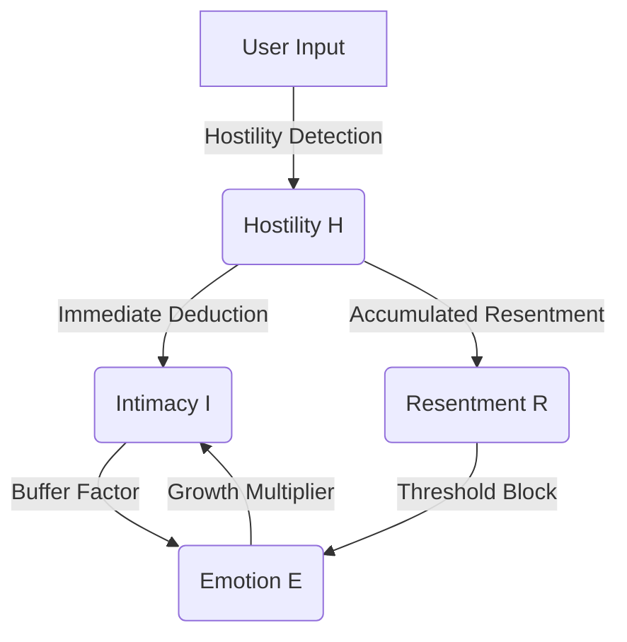

# AI Companion - Cognitive Architecture Framework

  

**[English](README_EN.md) | [中文](README.md)**

> **v2.8.0 Update**: UI/UX polished! Added dropdown gender selection, global breathing animation feedback dialogs, and optimized localized prompts.

---

## English Documentation

**AI Companion** is a "digital life" framework driven by a **Closed-Loop Cognitive Architecture**, distinct from typical stateless LLM wrappers. It integrates psychological modeling to give the AI internal state, emotional persistence, and dynamic personality evolution.

## 🏗️ 3-Layer Cognitive Architecture (L1-L3)

The system operates on a unidirectional cognitive pipeline inspired by human cognition.

```mermaid
graph TD
    User --> L1[L1: Perception Core]
    L1 -->|Perception Result| L2[L2: Decision Core]
    State[Emotional State (Memory)] --> L2
    Config[Personality Config] --> L2
    L2 -->|Inner Monologue| L3[L3: Expression Core]
    L3 -->|System Prompt| LLM
    LLM --> Output
```

### L1: Perception Core

Acts as the sensory cortex. It analyzes input without generating a response.

- **Offensiveness (0-10)**: Detects hostility (playful teasing vs. malicious attacks).
- **Underlying Needs**: Identifies implicit needs (e.g., *need for comfort*, *apology*, *praise*).
- **Time Sensitivity**: Determines if the physical time context is relevant (e.g., "Good morning").

### L2: Decision Core (The Brain)

The fusion center where "Thinking" happens. It combines:

- **Perception**: What the user said.
- **Emotion (V-A-R)**: How the AI feels right now.
- **Personality (Big Five)**: The AI's innate traits.

It generates an **Inner Monologue** (private thought) and a **Response Strategy** (Pacing, Topic Depth).

### L3: Expression Core (The Mouth)

Translates abstract decisions into natural language instructions for the LLM.

- **Tone Mapping**: "High Arousal + High Valence" -> "Excited/Playful".
- **Pacing Control**: Appends instructions for `single_shot` or `burst` mode.
- **Constraint Enforcement**: Ensures no forbidden patterns or lengths are violated.

## 🧠 Psychological Models & Formulas

The system relies on interpretable, quantifiable mathematical models rooted in classic psychology, rather than black-box LLM simulations.

### 1. H-E-I Dynamics Feedback Loop

A non-linear dynamic system deeply coupling **Hostility**, **Emotion**, and **Intimacy**.



#### A. V-A-R 3D Emotion Space

Based on the Russell Circumplex Model, extended with a Z-axis: **Resentment**.

$$
E_{t} = E_{t-1} + \Delta E_{stimulus} \times (1 - |E_{t-1}|)^\alpha
$$

- **Valence** $v \in [-1, 1]$: Pleasure vs. Displeasure.
- **Arousal** $a \in [0, 1]$: Energy level. Anger (High A) vs. Depression (Low A).
- **Resentment** $r \in [0, 1]$: Long-term accumulated grudge.
  - **Meltdown Condition**: Triggers when $r > 0.8 \land v < -0.7$, rejecting all positive interactions.

#### B. Intimacy Growth Function

Follows the law of diminishing returns, modulated by emotional state.

$$
\Delta I = Q_{interaction} \times E_{multiplier} \times T_{cooling} \times B(I)
$$

1. **Interaction Quality** $Q = f(Confidence, Valence) - Hostility \times 0.1$
2. **Emotion Multiplier** $E = 1 + (v \times 0.3)$ *(Happy AI bonds faster)*
3. **Time Factor** $T$: Penalizes spamming; interval approaching zero leads to $T \to 0$.
4. **Marginal Decay** $B(I) = \sqrt{1 - I}$ *(Harder to level up at higher tiers)*

---

### 2. Cognitive Laziness & Bio-Rhythm

To simulate biological realism, the system introduces **Cognitive Energy**. The AI gets "tired".

#### Fatigue Suppression Model

When arousal is too low or after continuous high-intensity dialogue, personality traits are suppressed.

$$
Trait_{effective} = Trait_{base} \times (1 - Fatigue \times W_{trait})
$$

| Trait | Fatigue Weight $W$ | Impact |
| :--- | :--- | :--- |
| **Openness** | 0.9 | Creativity drops significantly; responses become clichéd. |
| **Conscientiousness** | 0.8 | Stops "thinking deep" (CoT), favoring intuitive/lazy responses. |
| **Extraversion** | 0.5 | Willingness to initiate topics decreases; becomes passive. |

---

### 3. Social Radar & Micro-Expressions

L1 Perception Core has built-in detectors for specific social signals, triggering **Instant Micro-Emotions**.

| Signal Type | Trigger Condition | Micro-Emotion | Behavioral Result |
| :--- | :--- | :--- | :--- |
| **Jealousy** | Mentioning other AIs or partners | `jealousy_mild` | Tone becomes prickly; slight arousal increase. |
| **High Praise** | Extreme praise/confession | `pride_hidden` | Feigns modesty but boosts intimacy. |
| **Neglect** | Perfunctory 1-word reply ("Oh") | `disappointed` | Reduces response length; triggers mirror defense. |

---

### 4. Personality Evolution Engine

> **v2.8.0 Feature**: Supports drag-and-drop initial persona sculpting via "Genesis Radar".

Uses reinforcement learning to fine-tune Big Five parameters in real-time.

$$
\Delta Trait_i = D_{ir} \times M_{ag} \times A_{ctivation} \times I_{ntimacy} \times P(t)
$$

- $D_{ir}$: Feedback Direction (+1/-1).
- $M_{ag}$: Magnitude (Negative feedback weight is typically 1.2x positive).
- $A_{ctivation}$: Activation level of the trait in current response (Attribution).
- $P(t)$: **Neuroplasticity**, decays over time $P(t) \propto \frac{1}{t}$, simulating personality stabilization in adulthood.

## 🚀 Deployment

### Prerequisites

- Flutter SDK 3.10+
- Dart 3.0+
- Valid OpenAI (or compatible) API Key

### Quick Start

```bash
git clone https://github.com/ApolloEddy/AI_Companion.git
flutter pub get
flutter run -d windows # or android
```

### License

MIT License
