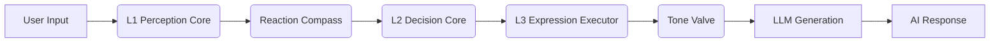

# AI Companion - Cognitive Architecture-Driven Digital Life Framework

   

**English | [中文](README.md)**

> **v3.0.0**: L3 Expression Layer Pure Executor Refactor — AI no longer "acts on its own", achieving clear separation of responsibilities in the architecture.

---

## 📖 Overview

**AI Companion** is not just another LLM chat interface. It's a "digital life" framework driven by a **closed-loop cognitive architecture**.

Unlike traditional "wrapper" applications, AI Companion features:

- **Persistent Internal State**: Emotions don't vanish when conversations end
- **Psychology-Modeled Affective System**: Based on Russell's Circumplex Model extended to V-A-R 3D space
- **Dynamically Evolving Personality**: Big Five traits slowly adjust based on interaction feedback
- **Quantifiable Social Relationships**: Intimacy follows a mathematically diminishing returns model
- **Bio-Rhythm Simulation**: AI gets "tired" too — late-night responses become lazier

---

## ✨ Key Features

### 🧠 Three-Layer Cognitive Architecture (L1-L3)

The system adopts a bio-inspired unidirectional data pipeline with strict separation of perception, decision, and execution:



### 💔 Realistic Emotional Feedback

AI develops **resentment** from offensive remarks. When accumulated beyond threshold, it triggers **psychological trauma mode**, entering a cold defensive state. Recovery requires time or genuine apology.

### 🎭 Four Social Stances

Based on Dominance and Heat dimensions, AI exhibits different reaction stances:

| Stance | Condition | Behavior |
|--------|-----------|----------|
| **Explosive** | D > 0.5 and H > 0.5 | Emotionally charged, direct confrontation |
| **ColdDismissal** | D > 0.5 and H ≤ 0.5 | Minimal response, no topic continuation |
| **Vulnerable** | D ≤ 0.5 and H > 0.5 | Expresses hurt, grievance-toned |
| **Withdrawal** | D ≤ 0.5 and H ≤ 0.5 | Perfunctory response, quick exit |

### 🎨 Personality Sculpting Radar

During initial AI creation, drag the 5 vertices of a radar chart to intuitively shape Big Five personality traits. Once locked, personality drifts slowly with interaction feedback — more interactions mean more stability.

### 🔒 L3 Pure Executor Design (v3.0 Architecture)

L3 no longer receives any natural language descriptions, only:

- **Enum states**: `relation_state: close`
- **Hard constraints**: `max_sentences: 2, forbid_metaphor: true`

This ensures L3 only "executes" without "thinking", eliminating issues of AI self-judging relationships, repairing awkwardness, or being inappropriately charming.

---

## 🔬 Technical Principles & Computational Models

### 1. Big Five (OCEAN) Personality Model

Adopts the psychological standard five-factor model, all dimensions normalized to `[0, 1]`:

| Dimension | Field | Low Value | High Value |
|-----------|-------|-----------|------------|
| **O**penness | `openness` | Conventional | Creative |
| **C**onscientiousness | `conscientiousness` | Laid-back | Disciplined |
| **E**xtraversion | `extraversion` | Introverted | Outgoing |
| **A**greeableness | `agreeableness` | Independent | Compliant |
| **N**euroticism | `neuroticism` | Emotionally Stable | Sensitive |

#### Plasticity Decay Formula

Personality stabilizes with interaction count — new changes become increasingly difficult:

$$
Plasticity_{effective} = Plasticity_{base} \times (1 - \eta)^{n/100}
$$

- $\eta = 0.1$: decay rate
- $n$: total interaction count

---

### 2. V-A-R Three-Dimensional Emotion Space

Extended from Russell's Circumplex Model with Z-axis **Resentment**:

```
        ↑ Arousal
        |
  Tense |  Excited
  Anxious |  Alert
---------+--------→ Valence
   Sad  |  Happy
  Depressed |  Calm
        |
        └── Resentment (depth axis)
```

#### Variable Definitions

| Variable | Symbol | Range | Description |
|----------|--------|-------|-------------|
| Valence | $V$ | $[-1, 1]$ | Pleasantness, negative = unhappy |
| Arousal | $A$ | $[0, 1]$ | Energy level, high = active |
| Resentment | $R$ | $[0, 1]$ | Long-term negative accumulation |

#### Emotion Decay Formula

Emotions regress toward baseline over time:

$$
V_{t} = V_{t-1} + (V_{base} - V_{t-1}) \times \alpha_{v} \times \Delta t
$$

$$
A_{t} = A_{t-1} + (A_{base} - A_{t-1}) \times \alpha_{a} \times \Delta t
$$

- Defaults: $V_{base} = 0$, $A_{base} = 0.5$
- Decay rates: $\alpha_v = 0.04$/hour, $\alpha_a = 0.05$/hour

#### Resentment Suppression Formula (Sigmoid)

High resentment suppresses positive emotion growth:

$$
\Delta V_{effective} = \Delta V_{raw} \times \left(1 - \frac{1}{1 + e^{-10(R - 0.5)}}\right)
$$

#### Meltdown Trigger Condition

When $R > 0.8$ and $V < -0.7$, AI enters emotional breakdown state.

---

### 3. Intimacy Growth Model

Follows **diminishing marginal returns** — higher intimacy means slower growth:

$$
\Delta I = Q \times E \times T \times B(I)
$$

| Factor | Symbol | Formula/Description |
|--------|--------|---------------------|
| Interaction Quality | $Q$ | $[0.5, 1.5]$ determined by perception |
| Emotion Multiplier | $E$ | $1 + V \times 0.3$ |
| Time Factor | $T$ | $\max(0.2, 1 - \Delta h \times 0.05)$ |
| Diminishing Function | $B(I)$ | $(1-I)^{0.5} \times \beta \times G$ |

- $\beta = 0.02$: base growth coefficient
- $G$: growth coefficient (affected by negative feedback, default 1.0)
- $\Delta h$: hours since last interaction

#### Negative Feedback Mechanism

Offensive behavior causes:

1. **Immediate deduction**: $I_{new} = I - severity \times 0.05$
2. **Growth coefficient reduction**: $G_{new} = G - 0.1 \times severity$
3. **Cooling period**: $2 + severity \times 6$ hours

---

### 4. Reaction Compass

When offensiveness $\geq 3$, calculate reaction stance:

#### Dominance

$$
D = (1 - A_{trait}) \times 0.4 + E_{trait} \times 0.2 + (1 - I) \times 0.3 + R \times 0.5
$$

- $A_{trait}$: Agreeableness
- $E_{trait}$: Extraversion
- $I$: Intimacy
- $R$: Resentment

#### Heat

$$
H = N_{trait} \times 0.6 + A_{emotion} \times 0.4
$$

- $N_{trait}$: Neuroticism
- $A_{emotion}$: Current arousal

#### Stance Decision Matrix

| | Heat > 0.5 | Heat ≤ 0.5 |
|---|---|---|
| **D > 0.5** | Explosive | ColdDismissal |
| **D ≤ 0.5** | Vulnerable | Withdrawal |

---

### 5. Bio-Rhythm Engine

Simulates human circadian rhythm — vitality naturally decreases at night:

```
Laziness
  0.9 ┤         ╭───────╮
      │       ╱           ╲
      │     ╱               ╲
  0.0 ┼────┴─────────────────┴────→ Time
      10:00 22:00 01:00 05:00 08:00
       Daytime  Rising  Peak   Recovery
       (Alert)  Fatigue (Maintain) 
```

#### Tolerance Formula

$$
Tolerance = (1 - Laziness) - 0.2 \times \mathbf{1}_{comfort} - 0.2 \times \mathbf{1}_{repeat}
$$

- $\mathbf{1}_{comfort}$: emotional care need indicator
- $\mathbf{1}_{repeat}$: repeated topic indicator

---

### 6. L3 Expression Constraints Configuration (v3.0)

Big Five personality traits are pre-computed in Dart layer, transformed into hard constraints injected into L3:

| Constraint | Calculation |
|------------|-------------|
| `max_sentences` | $\lfloor E \times 3 + 1 \rfloor$, range $[1, 5]$ |
| `metaphor_density` | $O \times 0.8$ (0 when hostile) |
| `emotional_leakage` | $N \times 0.6$ |
| `initiative_allowed` | $E > 0.5$ and not hostile |
| `emoji_allowed` | $I > 0.4$ and not hostile |
| `playful_allowed` | $O > 0.5$ and $I > 0.5$ and not hostile |

---

### 7. Memory Management System

Uses **SQLite** storage with pagination:

- **Working Memory**: 100 most recent entries in-memory
- **Deep Memory**: SQLite with keyword search
- **Importance Filtering**: Low-importance memories discarded
- **Auto Pruning**: Oldest memories deleted when limit exceeded

---

## 🛠️ Development & Deployment

### Requirements

- **Flutter SDK**: 3.10+
- **Dart SDK**: 3.0+
- **Valid API Key**: Alibaba Cloud DashScope (Qwen)

### Quick Start

```bash
# Clone repository
git clone https://github.com/ApolloEddy/AI_Companion.git
cd AI_Companion

# Install dependencies
flutter pub get

# Run (Windows)
flutter run -d windows

# Run (Android)
flutter run -d android

# Build Android Release APK
flutter build apk --release
```

### Configure API Key

After first launch, go to **Settings → API Configuration** and enter your Alibaba Cloud DashScope API Key.

---

## 📁 Project Structure

```
lib/
├── core/
│   ├── engine/           # Core Engines
│   │   ├── conversation_engine.dart   # Cognitive Scheduler
│   │   ├── emotion_engine.dart        # Emotion Computation
│   │   ├── intimacy_engine.dart       # Intimacy Model
│   │   ├── personality_engine.dart    # Personality Evolution
│   │   └── bio_rhythm_engine.dart     # Bio-Rhythm
│   ├── model/            # Data Models
│   │   ├── big_five_personality.dart  # Big Five
│   │   ├── relation_state.dart        # L3 State Enums
│   │   └── expression_profile.dart    # Expression Config
│   ├── perception/       # L1 Perception Layer
│   ├── decision/         # L2 Decision Layer
│   ├── prompt/           # Prompt Building
│   ├── policy/           # Policy Definitions
│   ├── mechanisms/       # Reaction Compass
│   └── memory/           # Memory Management
├── ui/                   # UI Components
└── main.dart
```

---

## 📜 License

This project is open-sourced under the [MIT License](LICENSE).

---

## 🔗 Links

- **GitHub**: [ApolloEddy/AI_Companion](https://github.com/ApolloEddy/AI_Companion)
- **Alibaba Cloud DashScope**: [dashscope.aliyuncs.com](https://dashscope.aliyuncs.com)
