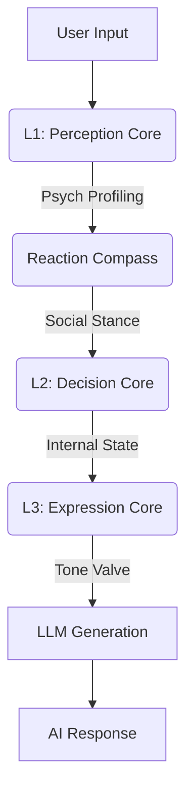
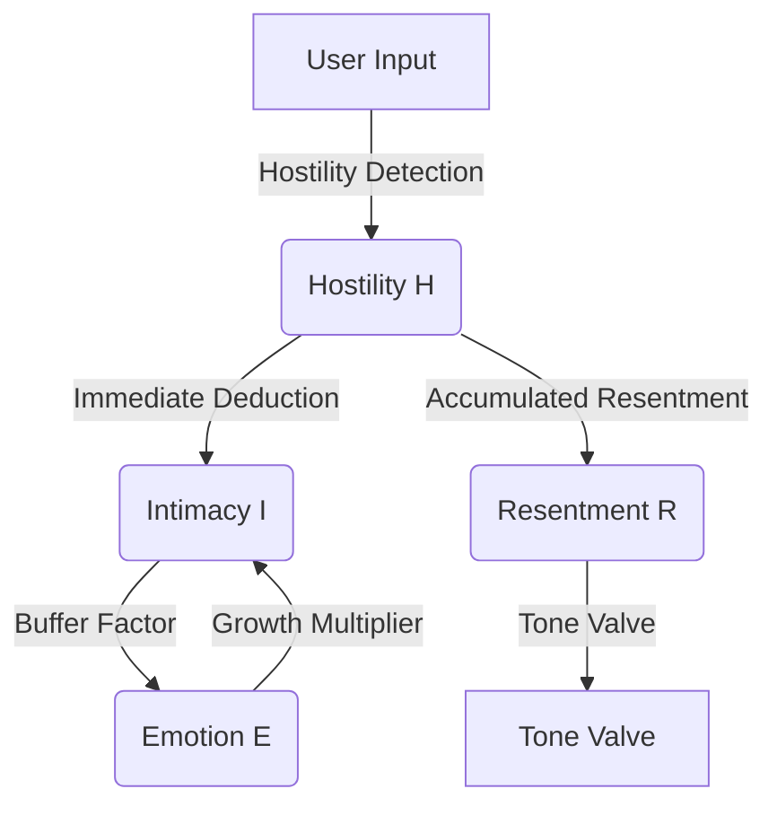

# AI Companion - Cognitive Architecture Framework

  

**[English](README_EN.md) | [中文](README.md)**

> **v2.9.0 Update**: Introducing **Reaction Compass** and **Tone Valve**. The AI now possesses a psychodynamics-based "temper," capable of detecting sarcasm, memes, and dynamically adjusting its defensive stance based on offensiveness.

---

## English Documentation

**AI Companion** is a "digital life" framework driven by a **Closed-Loop Cognitive Architecture**, distinct from typical stateless LLM wrappers. It integrates psychological modeling to give the AI internal state, emotional persistence, and dynamic personality evolution.

## 🏗️ 3-Layer Cognitive Architecture (L1-L3)

The system operates on a unidirectional cognitive pipeline inspired by human cognition:



### L1: Perception Core

Acts as the sensory cortex. It "listens" and "profiles," outputting high-precision JSON structures.

- **Semantic Category**: Distinguishes between `meme` (playful), `preference` (likes/dislikes), `boundary` (setting limits), and `fact` (statements).
- **Social Signal**:
  - **Offensiveness (0-10)**: Distinguishes playful teasing from malicious attacks.
  - **Meme Detected**: Identifies if the user is using internet slang/memes.

### Reaction Compass

Calculates the AI's social stance based on perception results and current personality state.

- **Dominance**: Decides whether to be "Assertive" or "Submissive".
- **Heat**: Decides whether to be "Intense" or "Cold".
- **Stance**:
  - `Explosive`: Emotional outburst, confrontation.
  - `ColdDismissal`: Indifferent, minimal response.
  - `Vulnerable`: Showing weakness, seeking peace.
  - `Neutral`: Normal conversation.

### L3: Expression Core

The execution layer responsible for "speaking," featuring the built-in **Tone Valve**.

- **Tone Valve**: Injects mandatory behavioral constraints via System Prompt based on Resentment and Cognitive Laziness.
  - **Hostile Level**: Strips service-oriented language, forbids apologies, forces short sentences.
  - **Cold Level**: Acts distant like a stranger, strips adjectives.
- **Pronoun Transformation**: Converts "He/She" in thoughts to "You" in dialogue.

## 🧠 Psychological Models & Formulas

The system relies on interpretable, quantifiable mathematical models rooted in classic psychology, rather than black-box LLM simulations.

### 1. H-E-I Dynamics Feedback Loop

A non-linear dynamic system deeply coupling **Hostility**, **Emotion**, and **Intimacy**.



#### A. V-A-R 3D Emotion Space

Based on the Russell Circumplex Model, extended with a Z-axis: **Resentment**.

$$
E_{t} = E_{t-1} + \Delta E_{stimulus} \times (1 - |E_{t-1}|)^\alpha
$$

- **Valence** $v \in [-1, 1]$: Pleasure vs. Displeasure.
- **Arousal** $a \in [0, 1]$: Energy level.
- **Resentment** $r \in [0, 1]$: Long-term accumulated grudge; directly determines the Tone Valve threshold.

#### B. Intimacy Growth Function

Follows the law of diminishing returns, modulated by emotional state.

$$
\Delta I = Q_{interaction} \times E_{multiplier} \times T_{cooling} \times B(I)
$$

### 2. Cognitive Laziness & Bio-Rhythm

To simulate biological realism, the system introduces **Cognitive Energy**. The AI gets "tired".

#### Fatigue Suppression Model

When arousal is too low or after continuous high-intensity dialogue, personality traits are suppressed.

$$
Trait_{effective} = Trait_{base} \times (1 - Fatigue \times W_{trait})
$$

### 3. Social Radar & Micro-Expressions

L1 Perception Core has built-in detectors for specific social signals, triggering **Instant Micro-Emotions**.

| Signal Type | Trigger Condition | Behavioral Result |
| :--- | :--- | :--- |
| **Meme** | Internet slang/memes | Skips fact extraction, responds playfully |
| **Boundary** | User sets boundaries | Triggers `Respect` intent, lowers intimacy attempts |
| **Sarcasm** | Sarcastic praise | Marked as negative feedback, triggers introspection |

## 🚀 Deployment

### Prerequisites

- Flutter SDK 3.10+
- Dart 3.0+
- Valid OpenAI (or compatible) API Key

### Quick Start

```bash
git clone https://github.com/ApolloEddy/AI_Companion.git
flutter pub get
flutter run -d windows # or android
```

### License

MIT License
