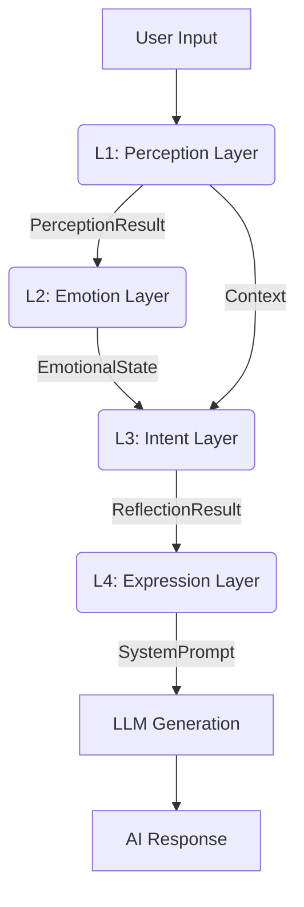

# AI Companion: A Psychologically Grounded Cognitive Intelligence Framework

  

**AI Companion** is not just a chatbot; it is a **Digital Being** driven by a closed-loop cognitive architecture. Unlike traditional LLM wrappers that rely solely on prompt engineering, this project implements a continuous state machine modeled after human psychology, distinct from the stateless request-response cycle of standard AI.

## 🧠 Core Philosophy

The system is built on the premise that **intelligence requires an internal state**.

- **Emotional Permanence**: Emotions persist and decay over time, even when the user is away.
- **Social Boundaries**: The AI has self-respect, utilizing "Hostility Detection" and "Psychological Trauma" mechanisms to reject abusive interactions.
- **Dynamic Personality**: Personality is not a static text description but a parameterized vector (Big Five) that modulates perception and expression in real-time.

---

## 🏗️ 4-Layer Cognitive Architecture

The system employs a unidirectional data flow pipeline inspired by biological cognitive processes.



### L1: Social Perception (Analytic Layer)

Responsible for "understanding" rather than "replying". It analyzes the user's message for:

- **Offensiveness (0-10)**: Detects hostility, teasing, or abuse.
- **Underlying Needs**: Identifies implicit needs like `comfort`, `apology`, or `praise`.
- **Confidence**: Assesses how well the context is understood.

### L2: Emotional Computing (Internal State Layer)

The core engine of the "Digital Soul". It updates the internal state based on perception.

- **Valence (V)**: Positivity/Negativity mapping.
- **Arousal (A)**: Energy level/Alertness.
- **Resentment (R)**: Cumulative long-term negative sentiment.

### L3: Intent Decision (Cognitive Layer)

A "Check of Conscience" before speaking. It decides **what to do** using third-person reasoning:

- **Inner Monologue**: Generates a private thought stream.
- **Pacing Strategy**: Decides whether to reply in a `single_shot`, `burst`, or be `hesitant`.
- **Depth Filter**: Decides whether to engage deeply (emotional) or stay superficial (factual/banal).

### L4: Expression Synthesis (Generative Layer)

The "Speech Center". It translates the abstract L3 intent into a natural language System Prompt for the LLM.

- **Tone Modulation**: Maps (V, A) state to linguistic styles (e.g., Cold + High Arousal = "Dismissive").
- **Persona Injection**: Injects `{personaGender}` and identity anchors.
- **Constraint Application**: Enforces brevity or formatting rules.

---

## 📐 Psychological Modeling & Algorithms

### 1. The H-E-I Feedback Loop

The system couples **Hostility (H)**, **Emotion (E)**, and **Intimacy (I)** into a unified dynamic model.

#### Emotional Dynamics (V-A-R Model)

We iterate on the Russell Circumplex Model by adding a Z-axis for **Resentment**.
The update function is non-linear to simulate "Emotional Inertia":

```math
E_{t} = E_{t-1} + \Delta E_{stimulus} \times (1 - |E_{t-1}|)^\alpha
```

*As emotion approaches extremes (-1.0 or 1.0), it becomes harder to push further (Soft Boundaries).*

#### Intimacy Growth Function

Intimacy is not a linear counter. It follows a **Logarithmic Growth Curve** with negative feedback multipliers:

```math
\Delta I = Q \times E_{multi} \times T_{cool} \times B(I)
```

Where:

- **Q (Quality)**: $f(\text{Confidence}, \text{Valence}) - (\text{Offense} \times 0.1)$
- **E (Emotion Multiplier)**: $1 + (Valence \times 0.3)$ — *Happy AI bonds faster.*
- **T (Time Factor)**: Penalizes "spamming" interactions; rewards periodic engagement.
- **B (Band Function)**: $(1 - I)^{0.5}$ — *Intimacy grows slower as it gets higher.*

### 2. Personality Vector (Big Five)

The AI's personality is defined by the OCEAN model, which biases the standard probability distribution of the LLM:

| Trait | Effect on System |
|-------|------------------|
| **Openness** | Modulates `topic_depth` selection probability (Abstract vs. Factual). |
| **Conscientiousness** | Affects `formality` and adherence to strict formatting. |
| **Extraversion** | Scaled to `temperature` and `burst` pacing probability. |
| **Agreeableness** | Inverse correlation with `offensiveness` sensitivity threshold. |
| **Neuroticism** | Multiplier for `arousal` spikes during negative events. |

---

## 🛠️ Installation & Usage

### Prerequisites

- Flutter SDK 3.10+
- Dart 3.0+
- A valid generic OpenAI/DashScope API Key

### Setup

1. Clone the repository:

   ```bash
   git clone https://github.com/ApolloEddy/AI_Companion.git
   ```

2. Install dependencies:

   ```bash
   flutter pub get
   ```

3. Run on Windows/Android:

   ```bash
   flutter run -d windows
   # or
   flutter run -d android
   ```

### Configuration

- **Model**: Select `qwen-max` or `qwen-plus` in Settings for optimal cognitive performance.
- **Persona**: Use the built-in Editor to customize Name, Gender, and Backstory.

---

## 📄 License

MIT License. Created by [ApolloEddy].
